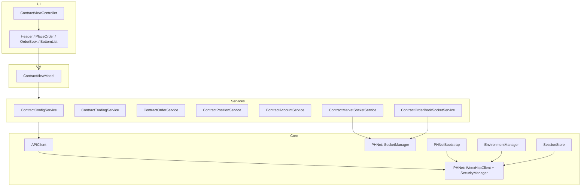

# WWSwift 合约页视觉与数据对齐 — 设计说明

**日期：** 2026-05-19  
**状态：** 已批准（brainstorming 用户确认）  
**父 Spec：** [`2026-05-19-wwswift-standalone-design.md`](2026-05-19-wwswift-standalone-design.md)  
**实现计划：** [`../plans/2026-05-19-wwswift-contract-page-parity.md`](../plans/2026-05-19-wwswift-contract-page-parity.md)  
**远端仓库：** https://github.com/doctor-lijy/WWSwift  
**本机路径：** `/Users/lijingyi/Desktop/WW/AITest/WWSwift`  
**weexios 只读对照：** `/Users/lijingyi/Desktop/WW/weexios/WeexExchange/WeexExchange/UI/Main/Trade/Contract/`

---

## 1. 背景与目标

P0–P5 已完成独立工程骨架、退出登录、合约 **流程可点通**（下单/撤单/改价/TP-SL/平仓）及 `weexios-mapping.md`。当前 `ContractViewController` 为**纵向极简布局**（Header → Segment → 简陋下单区 → 文本列表），与 weexios 合约交易页截图差距大。

**本 Spec 目标：** 在**不扩大工程范围**（仍仅合约页内核、排除跟单/TradFi/K 线/5-Tab）的前提下，通过三阶段里程碑 **M1 → M2 → M3**，使合约页在**布局**与**数据**上对齐 weexios 主交易屏。

| 维度 | 目标 |
|------|------|
| 布局 | 左下单 + 右盘口 + 底部持仓/委托列表（见 §5） |
| 数据 | 全链路真实：PHNet Socket + REST（用户已选 **C**） |
| 网络 | 混合：**C** — `APIClient` 门面 + PHNet `WeexHttpClient`/`SecurityManager` 签名 + `SocketManager` |
| 实施顺序 | 严格 **M1 → M2 → M3**（用户已选 **A**） |

---

## 2. 已锁定决策（Brainstorming）

| 问题 | 选择 |
|------|------|
| 页面范围 | **A** — 仅合约页内核；不做 5-Tab、跟单、TradFi、广告、K 线 |
| 数据策略 | **C** — 全链路真实（PHNet socket + REST + 真实持仓/账户） |
| 签名/网络 | **C** — 混合：`APIClient` 为入口；签名与 Socket 委托 PHNet |
| 里程碑 | **A** — 严格 M1 → M2 → M3 |
| M2 UI 区块 | **A** — 做 #2、4–13、15–17；不做顶栏 3-Tab、K 线、广告、5-Tab、跟单 |
| 文件结构 | **A** — 按区块拆独立 View，VC 作装配器 |

### M2 包含的 UI 区块（对照截图编号）

| # | 区块 | 实现 |
|---|------|------|
| 2 | Header（币对、永续、涨跌幅） | ✅ |
| 4 | 杠杆栏 | ✅ |
| 5 | 资金费率 + 倒计时 | ✅ |
| 6 | 开/平仓 Tab | ✅ |
| 7 | 限价/市价选择 | ✅ |
| 8 | 价格/数量输入 | ✅ |
| 9 | 数量滑块 | ✅ |
| 10 | 可用/可开/成本 | ✅ |
| 11 | TP/SL 开关（UI） | ✅ |
| 12 | 买卖双按钮 | ✅ |
| 13 | 右侧盘口 5+5 | ✅ |
| 15 | 底部 Segmented（持仓/当前委托） | ✅ |
| 16 | 底部工具栏（只看当前、一键平仓入口） | ✅ |
| 17 | 列表 Cell / 空态 | ✅ |

**明确不做：** 顶栏「合约交易/TradFi/跟单」、K 线、广告、底部 App 5-Tab、跟单按钮、TradFi、计划委托/追踪止损独立页、完整登录 UI。

---

## 3. 现状 Gap（2026-05-19 基线）

| 维度 | 当前 WWSwift | weexios 预期 |
|------|--------------|--------------|
| 布局 | 纵向堆叠 | 左右分栏 + 底部全宽列表 |
| Header | 币对名 + 切换 | + 涨跌幅、资金费率区 |
| 下单 | 简化 `PlaceOrderPanelView` | 完整下单区 + 滑块 + 双按钮 |
| 盘口 | 无 | `WContractOrderBookView` 5+5 |
| 底部 | 文本 `UITableView` | Segmented + Toolbar + 专用 Cell |
| PHNet | **已部分接入**（见 §4） | 全量行情/盘口/资金费率/账户 |

**已有可复用代码（勿重复造轮子）：**

- `PHNetBootstrap`、`APIClient.postViaPHNet`、`SocketBootstrap`
- `ContractMarketSocketService`（301/310 行情）
- `ContractViewModel`（`currentTick`、`socketConnected`、`onTickUpdate`）
- `ContractConfigService`（`getMetaDataNew`）
- 各 `Contract*Service` 与 `ContractCoordinator` 下单/仓位流程

---

## 4. 架构总览



**分层原则（与父 Spec 一致）：** View → ViewModel → Coordinator → Service → APIClient；禁止 SwiftUI；UIKit + SnapKit。

---

## 5. weexios 对照映射

### 5.1 Manager / Core

| weexios | 职责 | WWSwift | 里程碑 |
|---------|------|---------|--------|
| `ConfigManager` / meta API | 合约元数据 | `ContractConfigService` | M1 验收 |
| `ContractTradeManager` | 下单/撤单/改价/平仓 | `ContractOrderService` + `ContractTradingService` | M1/M3 |
| 持仓查询 API | 真实持仓 | `ContractPositionService`（增强 `fetchPositions`） | M3 |
| `AssetManager` / collateral | 可用、可开、成本 | **`ContractAccountService`**（新增） | M3 |
| `SocketManager` | 行情 | `ContractMarketSocketService`（已有，扩展） | M3 |
| `SocketManager` | 盘口 | **`ContractOrderBookSocketService`**（新增） | M3 |
| `SocketManager` | 资金费率 | 扩展 `ContractMarketSocketService` 或独立 receiver | M3 |
| `TradeSettingsHelper` | 杠杆/逐仓/开平仓 | **`ContractTradeSettingsStore`** | M2 UI / M3 同步 |

### 5.2 UI

| weexios | WWSwift View |
|---------|--------------|
| `WContractHeaderView` | `Views/Header/ContractHeaderView` |
| 杠杆/资金费率相关子 View | `LeverageBarView`, `FundingRateBarView` |
| `WContractPlaceOrderView` 子组件 | `Views/PlaceOrder/*` |
| `WContractOrderBookView` | `Views/OrderBook/ContractOrderBookView` |
| 持仓/委托 Cell | `ContractPositionCell`, `ContractOrderCell` |
| 底部 Tab + 工具栏 | `BottomSegmentedView`, `BottomToolbarView`, `EmptyStateView` |

### 5.3 排除（EXCLUDED / OUT_OF_SCOPE）

- `CopyTrade/**`、`WContractCopyTradeController`、`WFollowOrderViewController*`
- `WContractController+TradFi`、`WAdvertisementView`、K 线容器
- `TradeHistory/**`、`Calculate/**`（除非后续单独立项）

---

## 6. 里程碑

### M1 — 网络底座（PHNet 混合集成）

**目标：** Test 环境 + Debug Token 下 REST 真实可用；为 M2/M3 打底。

| 任务 | 说明 | 基线状态 |
|------|------|----------|
| `project.yml` 链接 `PHNet.xcframework` | + `AFNetworking` Pod | **DONE** |
| `PHNetBootstrap` | `RuntimeAPPEnv`、HTTP/Socket header、域名 | **DONE** |
| `APIClient` → `WeexHttpClient.postJson` | Mock 仍走 JSON | **DONE** |
| `EnvironmentManager` ↔ `DomainManager.switch` | 环境切换 | **DONE** |
| `docs/api/signing.md` | 声明签名由 PHNet 承担 | **TODO** |
| 更新 `endpoints.md` / `mapping.md` | 移除已废弃的 `RequestSigning` 描述 | **TODO** |
| Token 变更后 Socket 重连 | Debug 注入 token 后 `SocketBootstrap` 刷新 | **TODO** |
| 验收 | test + token → `getMetaDataNew` code=0 | **TODO** |

**验收清单：**

- [ ] `xcodegen generate && pod install` 后 `WWSwift.xcworkspace` 编译通过
- [ ] Mock 环境仍可用本地 JSON
- [ ] Test 环境注入三 token 后 `ContractConfigService.fetchSymbols()` 返回非空列表
- [ ] 无 `RequestSigning` / `TODO_P1_FULL_SIGN` 残留于源码

---

### M2 — UI 视觉对齐（Mock/静态数据撑场）

**目标：** 单屏布局与 weexios 截图结构一致；交互可走现有 mock/简化 API 路径。

#### 6.1 布局（自上而下）

```
┌─────────────────────────────────────────┐
│ ContractHeaderView                      │
├──────────────────────┬──────────────────┤
│ LeverageBarView      │                  │
│ FundingRateBarView   │ ContractOrderBook│
│ OpenCloseTabView     │ View             │
│ PlaceOrderPanelView  │                  │
├──────────────────────┴──────────────────┤
│ BottomSegmentedView                       │
│ BottomToolbarView                         │
│ UITableView (PositionCell / OrderCell)    │
│ EmptyStateView                            │
└─────────────────────────────────────────┘
```

- `ContractViewController`：**装配器**，不堆积业务逻辑。
- 上区：`UIStackView` 水平 — 左列下单栈、右列盘口（固定宽度比例约 55:45，以 SnapKit 实现）。
- 下区：全宽列表；整体可包在 `UIScrollView` 内（小屏可滚动）。

#### 6.2 目录结构

```
WWSwift/Features/Contract/
├── ViewControllers/
│   └── ContractViewController.swift
├── Views/
│   ├── Header/
│   │   ├── ContractHeaderView.swift      # 增强
│   │   └── LeverageBarView.swift
│   ├── PlaceOrder/
│   │   ├── FundingRateBarView.swift
│   │   ├── OpenCloseTabView.swift
│   │   ├── OrderTypeSelectorView.swift
│   │   ├── PriceSizeInputView.swift
│   │   ├── SizeSliderView.swift
│   │   ├── AvailableBalanceView.swift
│   │   ├── TpSlToggleView.swift
│   │   ├── CostPreviewView.swift
│   │   ├── PlaceOrderButtonsView.swift
│   │   └── PlaceOrderPanelView.swift     # 容器，组合上述子 View
│   ├── OrderBook/
│   │   └── ContractOrderBookView.swift
│   └── BottomList/
│       ├── BottomSegmentedView.swift
│       ├── BottomToolbarView.swift
│       ├── ContractPositionCell.swift
│       ├── ContractOrderCell.swift
│       └── EmptyStateView.swift
├── ViewModels/
│   └── ContractViewModel.swift           # 扩展 UI 状态
└── Models/
    ├── ContractOrderBookSnapshot.swift   # Mock 盘口模型
    └── ContractTradeSettings.swift       # 杠杆/模式等
```

**删除或降级：** `ContractSegmentView`（职责并入 `BottomSegmentedView`）。

#### 6.3 ViewModel 状态（M2 可先静态）

| 状态 | M2 | M3 |
|------|----|----|
| `selectedSymbol`, segment | ✅ | ✅ |
| `leverage`, `marginMode`, `openCloseMode` | 默认 20x / 逐仓 / 开仓 | API + `ContractTradeSettingsStore` |
| `orderType`, `price`, `size`, `sizePercent` | UI 双向绑定 | 联动计算 |
| `availableBalance`, `maxOpen*`, `cost` | 占位 | `ContractAccountService` |
| `fundingRate`, `countdown` | 静态 | Socket |
| `orderBook` | `ContractOrderBookSnapshot.mock()` | Socket |
| `positions`, `activeOrders` | Mock 或现有数据 | REST + 推送刷新 |

**M2 验收：**

- [ ] 模拟器布局：左右分栏 + 底部列表，与截图结构一致
- [ ] 可切换币对、开/平仓、限价/市价、滑块、绿/红双按钮
- [ ] 盘口显示 Mock 5+5；底部切换持仓/委托；空态与充值/划转占位（无跟单）
- [ ] Mock 环境全流程仍可点通（不依赖真实 Socket）

---

### M3 — 实盘数据接入

| 数据 | 通道 | PHNet / API |
|------|------|-------------|
| 最新价、涨跌幅 | Socket | `subscribeMarketsOfContract` / 301、310 |
| 盘口 5+5 | Socket | `subScribeOrderBookOfContract` → `ContractOrderBookSocketService` |
| 资金费率 + 倒计时 | Socket | `subScribeFundingRateOfContract` |
| 可用余额 | REST | 对照 `AssetManager`，记入 `endpoints.md` |
| 可开/成本 | REST + 本地公式 | 简化版，对照 `WContractPlaceOrderViewModel` |
| 持仓 | REST | `ContractPositionService` |
| 当前委托 | REST | 已有 `getActiveOrderPage`；下单后 refresh |
| 私有推送 | Socket | 登录后订阅（按 PHNet 能力逐步接） |

**M3 验收：**

- [ ] Test + Debug Token：Header 价格跳动、`socketConnected` 指示正确
- [ ] 盘口档位随推送更新
- [ ] 可用余额为真实值；下单后委托列表刷新
- [ ] `docs/reference/weexios-mapping.md` 合约 UI/网络行更新为 DONE/PARTIAL 准确状态

---

## 7. 错误处理

| 场景 | 行为 |
|------|------|
| 未登录 / 无 Token | 下单区禁用；列表提示「请先在 Debug 页注入 Token」 |
| Socket 断线 | Header 显示断线；行情/盘口冻结最后值 |
| API `code != 0` | Alert；非 logout 不清 session |
| 环境切换 | `EnvironmentManager.didChangeNotification` → 重载 meta、重连 Socket、清空盘口缓存 |

---

## 8. 测试策略

| 层级 | M1 | M2 | M3 |
|------|----|----|-----|
| 单元测试 | `ContractConfigService` mock PHNet 响应解析 | `ContractViewModel` 盘口/滑块状态机 | `ContractAccountService` 解析 |
| 手动 | Debug 页切 test + token | 模拟器截图对比 | test 环境真实跳动 |

不新增 UI 自动化；保持现有 `WWSwiftTests` 风格。

---

## 9. 文档与 Skills 更新

| 文档 | 时机 |
|------|------|
| `docs/api/signing.md` | M1 |
| `docs/api/endpoints.md` | M3（账户/持仓 path） |
| `docs/reference/weexios-mapping.md` | 每里程碑末 |
| `.codex/skills/wwswift-oc-to-swift-contract/SKILL.md` | M2 后补充 View 目录约定 |

---

## 10. 非目标（再次确认）

- App 级 5-Tab、跟单、TradFi、广告、K 线全屏
- 完整登录/注册 UI
- 从 weexios 拷贝任何 `.m`/`.h`/`.swift` 源码
- 除 `PHNet.xcframework` 外的 weexios 二进制

---

## 11. 参考

- 父 Spec §10 PHNet 接入：`2026-05-19-wwswift-standalone-design.md`
- 对照表：`docs/reference/weexios-mapping.md`
- weexios 主 VC：`Contract/Controller/WContractController.m`
- weexios 下单：`Contract/View/PlaceOrder/`
- weexios 盘口：`Contract/View/WContractOrderBookView.m`
