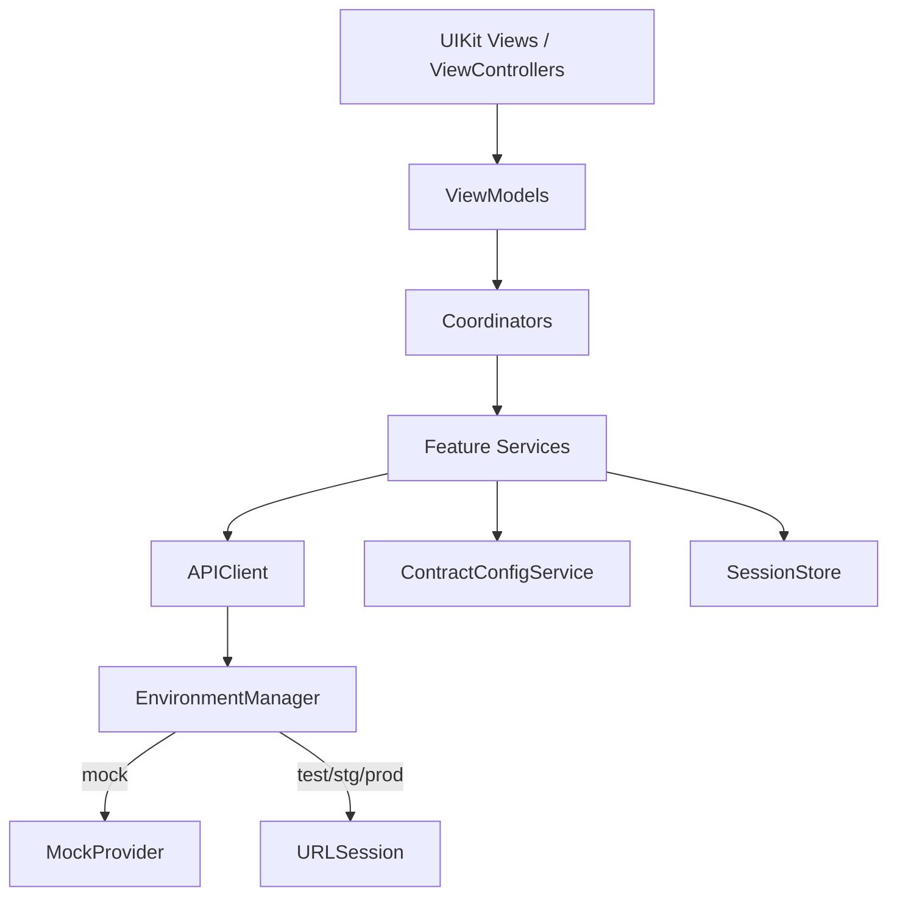

# WWSwift 独立工程设计说明

**日期：** 2026-05-19（2026-05-19 修订：纳入 PHNet 二进制依赖）  
**状态：** 已评审（brainstorming 阶段用户确认）  
**远端仓库：** https://github.com/doctor-lijy/WWSwift  
**本地工作目录：** `/Users/lijingyi/Desktop/WW/AITest/WWSwift`（本机唯一 clone，勿在 `WW/WWSwift` 重复维护）  
**参考工程：** weexios / `WeexExchange`（只读对照，原则零源码依赖）  
**例外依赖：** `PHNet.xcframework` 视作公司内部已编译 SDK，以二进制方式纳入 `WWSwift/Vendor/`（仅此一例）

> **仓库约定：** 本仓库为设计与实现的唯一落点；weexios 仅作对照参考，不在 weexios 中提交 WWSwift 相关改动。
>
> **PHNet 例外说明（2026-05-19 修订）：** 原 spec 与 `AGENTS.md` 中「不拷贝 PHNet/WeexNet」的条款已调整为允许 `PHNet.xcframework`。背景：本工程定位为对照学习与 Swift 重写、**不上线**；自行用 Swift 复刻 PHNet（HTTP 签名、Socket 协议帧、域名探测）成本约 3-4 周且需对 PHNet 私有协议做协议级逆向，与「学习 weexios 业务实现」的核心目标偏离。把 PHNet 当作公司内部 binary SDK，能立即获得**真实数据**（HTTP + Socket 全部订阅码），将精力聚焦在业务层的 Swift 重写。详见 §10。

---

## 1. 背景与目标

将 weexios 中以下能力用 **Swift + UIKit** 在 **独立工程 `WWSwift`** 中重新实现：

- **合约交易模块**（对齐 weexios 行为，排除跟单）
- **退出登录链路**（不含注册/登录/忘记密码等完整登录域）

工程与 weexios **不混编、不 Pod 接入、不做 OC 桥接**。weexios 仅作为需求、API、交互与目录结构的参考源。

**交付目标（双重）：**

1. **参考实现 / 技术沉淀**：模块边界清晰、可对照 weexios 文件映射。
2. **可运行 Demo**：独立编译运行；支持 Mock 与测试/真实环境切换；核心流程可点通、逻辑可测。

**技术约束：**

- UI：**UIKit**（禁止 SwiftUI）
- 布局：**SnapKit**
- 最低系统：**iOS 14.0**
- 工程组织：**方案 1 — 单 Target 分层**

---

## 2. 非目标（明确排除）

| 排除项 | 说明 |
|--------|------|
| 与 weexios 集成 | 不修改 weexios 以引用 WWSwift；不在 weexios Podfile 增加 WWSwift |
| 跟单 / CopyTrade | `WContractCopyTradeController`、`UI/Main/Trade/CopyTrade/**`、`WFollowOrderViewController*` 等 |
| 完整登录域 | 注册、登录、忘记密码、三方登录 UI 均不在范围；仅退出 + Debug 注入 Token |
| SwiftUI | 全项目禁止 |
| 拷贝 weexios 源码 | `.h`/`.m`/`.swift` 一律不拷；`WeexNet.m` 那套初始化在 Swift 重写 |
| 其他 weexios 私有 framework | 仅 `PHNet.xcframework` 例外允许，其余（若存在）一律禁止 |

---

## 3. 合约模块范围

对应 weexios `UI/Main/Trade/Contract/`（约 130+ OC 文件）的功能等价实现，按三期能力 **A + B + C** 一次对齐（实施分阶段，见 §8）：

| 层级 | 能力 |
|------|------|
| **A — 骨架** | 交易页容器、币对切换、Header、K 线/盘口（可先简化或占位）、下单区、当前委托/持仓列表展示 |
| **B — 下单闭环** | 限价/市价、杠杆/保证金模式、下单确认弹窗、下单 API 与状态反馈 |
| **C — 仓位/委托管理** | 平仓、改单、止盈止损等主要弹窗与操作 API |

**不纳入第一期对照清单（除非后续单独立项）：**

- `TradeHistory/` 全套历史页
- `Calculate/` 计算器
- `Expand/` 设置/资金记录等扩展页
- 跟单相关 UI 与 `CopyTradeSettingsHelper` 专用流程

**weexios 跟单排除文件（迁移时禁止参照实现）：**

- `UI/Main/Trade/CopyTrade/**`
- `Contract/Controller` 内嵌的 `WContractCopyTradeController` 集成逻辑
- `WFollowOrderViewController` / `WFollowOrderViewControllerV2`
- `Expand/vc/WCopyTradeSettingViewController`

---

## 4. 退出登录范围

**范围：** 仅退出链路（用户选项 A）。

**参考调用链（weexios）：**

```
WUserInfoController / WChangeLoginPasswordController
  → WLoginManager.logOutCallBack
    → LoginHandler.logout (POST api_user_logout)
    → UserManger.cleanUserinfo
  → UI 反馈（loading / toast / pop）
```

**WWSwift 等价职责：**

| 组件 | 职责 |
|------|------|
| `LogoutService` | 调用 `v1/user/login/logout`，处理错误码 |
| `SessionStore` | 清除 token、userId、本地用户缓存 |
| `LogoutSideEffectRegistry` | 对齐 `cleanUserinfo`：发通知、清理合约口令缓存、统计 SDK logout 等（逐项清单化） |
| `LogoutCoordinator` | 展示 loading、结果提示、导航回未登录/根页面 |
| Debug 页 | 注入测试 Token，便于无登录 UI 下验证退出 |

**不实现：** 完整登录表单；仅 Debug 提供「设置 Token / 用户 ID」用于 Demo。

---

## 5. 工程结构（方案 1）

```
WWSwift/
├── WWSwift.xcodeproj
├── WWSwift/
│   ├── App/
│   │   ├── AppDelegate.swift
│   │   ├── SceneDelegate.swift          # 若使用 Scene
│   │   ├── MainTabBarController.swift
│   │   └── Debug/
│   │       └── EnvironmentDebugController.swift
│   ├── Core/
│   │   ├── Network/
│   │   │   ├── APIClient.swift
│   │   │   ├── EnvironmentManager.swift
│   │   │   ├── RequestSigning.swift     # 对齐 weexios 签名规则（文档化）
│   │   │   └── MockProvider.swift
│   │   ├── Session/
│   │   │   └── SessionStore.swift
│   │   ├── Config/
│   │   │   └── ContractConfigService.swift
│   │   ├── Storage/
│   │   │   └── UserDefaultsStorage.swift
│   │   ├── Theme/
│   │   └── Extensions/
│   ├── Features/
│   │   ├── Contract/
│   │   │   ├── Coordinator/
│   │   │   ├── ViewControllers/
│   │   │   ├── Views/
│   │   │   ├── ViewModels/
│   │   │   ├── Services/
│   │   │   └── Models/
│   │   └── Logout/
│   │       ├── LogoutCoordinator.swift
│   │       ├── LogoutService.swift
│   │       └── LogoutSideEffects.swift
│   └── Resources/
├── docs/
│   ├── reference/
│   │   └── weexios-mapping.md           # OC 文件 → Swift 模块对照
│   └── api/
│       └── endpoints.md                   # 从 ApiConst 摘录的关键 API
├── .cursor/
│   ├── rules/
│   └── agents/
├── .codex/skills/                        # 或与 .cursor/skills 对齐
├── Podfile                                # SnapKit 等三方
├── AGENTS.md
└── README.md
```

**架构模式：** UIKit View → ViewModel → Coordinator → Feature Service → APIClient / ConfigService / SessionStore。



---

## 6. 网络与环境（Mock ⇄ 测试环境）

**EnvironmentManager** 支持：

| 模式 | 行为 |
|------|------|
| `mock` | `MockProvider` 返回本地 JSON / 内存数据 |
| `test` / `stg` / `prod` | 使用对应 baseURL（对齐 weexios `DomainManager` / `AppENV_*`） |

**持久化：** `UserDefaults` 键 `currentEnv`（与 weexios 概念对齐，便于对照调试）。

**Debug 菜单（仅 DEBUG）：**

- 切换 `mock | test | stg | prod`
- 显示当前 baseURL
- 注入 / 清除 Session Token
- 触发「退出登录」

**实现原则：**

- 不嵌入 `PHNet.xcframework`
- API 路径对照 `WeexExchange/.../Common/Const/ApiConst.h` 维护 `docs/api/endpoints.md`
- 签名、公共参数在 `RequestSigning` 单点实现并附 weexios 对照说明

---

## 7. Cursor Agents / Rules / Skills（P0 先行）

在 **本仓库（WWSwift）** 创建并维护；weexios 不承载实现与文档更新。

### 7.1 Agents（`.cursor/agents/`）

| Agent | 职责 |
|-------|------|
| `wwswift-architect` | 模块拆分、目录审查、禁止依赖 weexios |
| `wwswift-contract-port` | 对照 Contract 目录产出 Swift 文件清单与验收项 |
| `wwswift-logout-port` | 对照退出链路，维护 SideEffect 清单 |
| `wwswift-network-env` | 环境切换、API、签名与 Mock 一致性 |

### 7.2 Rules（`.cursor/rules/`）

| Rule | 内容 |
|------|------|
| `wwswift-swift-uikit.mdc` | Swift 风格、UIKit、SnapKit、4 空格、禁止 SwiftUI |
| `wwswift-weexios-parity.mdc` | 功能对齐检查表、跟单排除列表 |
| `wwswift-no-weexios-import.mdc` | 禁止 import / 链接 weexios 任何模块 |

### 7.3 Skills（`.codex/skills/`）

| Skill | 内容 |
|-------|------|
| `wwswift-oc-to-swift-contract` | 合约迁移步骤、排除列表、分阶段验收 |
| `wwswift-logout-flow` | 退出时序、API、清状态、通知 |
| `wwswift-env-and-api` | 环境切换、Mock、关键 endpoint 表 |

---

## 8. 分阶段实施计划

| 阶段 | 交付物 | 验收标准 |
|------|--------|----------|
| **P0** | Xcode 工程、SnapKit、Agents/Rules/Skills、`EnvironmentManager`、Mock、Session、Debug 页 | 可编译；可切换环境；可注入 Token |
| **P1** | `LogoutService` + `SessionStore.clear` + SideEffects + UI 触发 | 测试环境可调 logout API；Mock 下可模拟成功/失败 |
| **P2** | 合约页骨架、Config 拉取、行情订阅（可简化） | 切换币对；列表展示；Mock/Test 均可跑 |
| **P3** | 下单闭环 | 限价/市价下单；确认弹窗；委托列表刷新 |
| **P4** | 仓位/委托管理弹窗 | 平仓/改单/TP-SL 主流程可测 |
| **P5** | `weexios-mapping.md` 对照与 gap 清单 | 核心路径与 weexios 行为一致（记录已知差异） |

---

## 9. 依赖

### 9.1 Podfile

```ruby
platform :ios, '14.0'
use_frameworks!

target 'WWSwift' do
  pod 'SnapKit'
  pod 'SDWebImage'
  pod 'AFNetworking', '~> 4.0'   # PHNet.xcframework 运行时依赖
end
```

### 9.2 Vendor 二进制依赖

- `WWSwift/Vendor/PHNet.xcframework`（公司内部 SDK，二进制；从 weexios 仓库拷贝同步）
- 在 `project.yml` 中以 `dependencies: [{ framework: Vendor/PHNet.xcframework, embed: true }]` 引入

---

## 10. PHNet 接入方案

> 详尽接入路径见 `docs/reference/phnet-integration.md`（P2 起补齐）。本节记录边界与初始化责任。

### 10.1 公开依赖面

只调用 PHNet 暴露的 OC API（umbrella header `PHNet/PHNet.h`），主要类：

| 类型 | 用途 |
|------|------|
| `RuntimeAPPEnv` | 启动期注入：socketHeader / configHeader / CDN / 域名 / 线路 / 登录判定 / 埋点回调 |
| `DomainManager` | 环境切换（`AppENV_TEST/STG/PROD/GRAY/IP`）、域名探测、`getRealUrl_New(_:)` 等 |
| `WeexHttpClient` | HTTP 请求（GET/POST/JSON/Form/Multipart） |
| `SocketManager` | Socket 启动、订阅/退订（合约/现货/资产/账户） |
| `SecurityManager` | 反爬/反风控（未来按需） |

### 10.2 Swift 侧补齐（独立实现）

PHNet 自身不知道「业务」侧字段；下列由 WWSwift 自行用 Swift 提供：

- `DeviceInfoProvider`：`vs`（随机串）、`sidecar`、`appVersion`、`packageName`、`deviceID`、MD5 工具
- `PHNetBootstrap`：启动期一次性调 `RuntimeAPPEnv.setSocketHeader/setConfigHeader/...`
- 业务签名 `originSIG = md5("weex" + ts + vs + clientType + verName + packageName + deviceID)`

### 10.3 集成边界

- 不引入 weexios 任何 `.m` 文件（含 `WeexNet.m` / `DeviceManager.m` 等），算法**重写**于 Swift
- 仅 `PHNet.xcframework` 一份二进制；其他 weexios framework 一律禁止
- `EnvironmentManager`（P0 既有）转为 `DomainManager` 薄封装；保留对外 API 不变

---

## 11. 错误处理与测试

**错误处理：**

- 网络层统一 `APIError`（code / message / isNetworkError）
- UI 层：Toast / Alert；退出失败保留登录态
- Socket 断线：合约页展示重连提示（P2+）

**测试策略：**

- Mock 模式：单元测试 ViewModel（下单参数、退出后 Session 为空）
- Test 环境：手动 QA 清单（退出、下单、平仓各 1 条）
- 不要求首发 CI；P0 后可选 GitHub Actions `xcodebuild`

---

## 12. 风险与缓解

| 风险 | 缓解 |
|------|------|
| 签名/域名与 weexios 不一致 | `wwswift-network-env` skill + `endpoints.md`；Debug 页打印请求 URL |
| 合约范围膨胀 | 严格排除跟单；TradeHistory/Calculate/Expand 不纳入本 spec |
| 无登录 UI 无法测退出 | Debug 注入 Token |
| 130+ 文件对照遗漏 | `weexios-mapping.md` 按目录勾选 |

---

## 13. 已确认决策记录

| 决策 | 选择 |
|------|------|
| 工程关系 | 独立仓库，与 weexios 零交叉 |
| 工程结构 | 方案 1：单 Target 分层 |
| UI 框架 | UIKit + SnapKit |
| 合约范围 | A + B + C（排除跟单） |
| 登录域 | 仅退出 |
| 网络 | Mock + Test/Stg/Prod 可切换 |
| 目标 | 参考沉淀 + 可运行 Demo |
| 文档与提交 | 仅本仓库（WWSwift），weexios 只读对照 |
| 本机工作目录 | `/Users/lijingyi/Desktop/WW/AITest/WWSwift` |

---

## 14. 下一步

1. ~~用户审阅本 spec~~（已确认）
2. ~~生成 implementation plan（writing-plans）~~（已完成 P0-P5）
3. **2026-05-19 PHNet 接入子计划**：详见 `docs/superpowers/plans/2026-05-19-wwswift-phnet-integration.md`（待生成）
